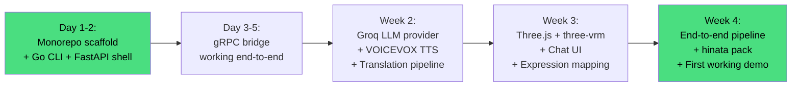

# 🌸 Keshin (化身) — Complete Project Roadmap

> **Bring anime characters to life.**
>
> Keshin is an open-source Go + Python + Web SDK for building anime character companions.
> Users chat in English. Characters respond in Japanese with subtitles. Characters are
> delivered as drop-in packs — VRM model + voice + personality — and run on desktop or web.

---

## 0. Vision & Principles

### What Keshin Is

An **engine**, not an app. Developers and makers use Keshin to build:
- Desktop anime companions (system tray pet)
- Web-based character chat platforms
- Their own character-driven applications
- Custom character packs for others to use

### What Keshin Is NOT

- A closed SaaS product
- A single app you download and run (though you CAN do that)
- A replacement for Kokoro Engine, AIRI, or Open-LLM-VTuber (different niche)

### Core Tenets

| Tenet | Meaning |
|-------|---------|
| **Free-first** | Every default provider (LLM, TTS, STT) must work without payment |
| **SDK-first** | Users are developers building things, not end-users installing apps |
| **Pack-based** | Characters are drop-in folders, not hardcoded configs |
| **Japanese output** | Characters speak Japanese; users type/speak English |
| **Desktop + Web** | Same codebase, two deployment modes |
| **Go shell, Python brain** | Go handles process management, networking, desktop; Python handles AI/ML |
| **Extensible** | Every provider (LLM, TTS, STT, renderer) is swappable via interfaces |

---

## 1. Architecture Overview

```
┌──────────────────────────────────────────────────────────────┐
│                        Keshin Engine                         │
│                                                              │
│  ┌──────────────────────────────────────────────────────┐    │
│  │                   Go Core (keshin)                    │    │
│  │                                                       │    │
│  │  ┌──────────┐ ┌──────────┐ ┌──────────┐ ┌─────────┐  │    │
│  │  │ Process  │ │ Config   │ │ Plugin   │ │ System  │  │    │
│  │  │ Manager  │ │ Registry │ │ Loader  │ │ Tray    │  │    │
│  │  └──────────┘ └──────────┘ └──────────┘ └─────────┘  │    │
│  │  ┌──────────┐ ┌──────────┐ ┌──────────┐ ┌─────────┐  │    │
│  │  │ Session  │ │ Audio    │ │ Bridge   │ │ Pack    │  │    │
│  │  │ Manager  │ │ Playback │ │ Server   │ │ Loader  │  │    │
│  │  └──────────┘ └──────────┘ └──────────┘ └─────────┘  │    │
│  │                                                       │    │
│  │  Manages: Python lifecycle, gRPC/HTTP bridge,        │    │
│  │           Wails desktop shell, config hot-reload      │    │
│  └──────────────────────┬───────────────────────────────┘    │
│                         │                                    │
│              gRPC / HTTP / Subprocess                        │
│                         │                                    │
│  ┌──────────────────────┴───────────────────────────────┐    │
│  │              Python AI Services (keshin-ai)            │    │
│  │                                                       │    │
│  │  ┌──────────┐ ┌──────────┐ ┌──────────┐             │    │
│  │  │ LLM      │ │ TTS      │ │ STT      │             │    │
│  │  │ Provider │ │ Provider │ │ Provider │             │    │
│  │  │ Manager  │ │ Manager  │ │ Manager  │             │    │
│  │  └──────────┘ └──────────┘ └──────────┘             │    │
│  │  ┌──────────┐ ┌──────────┐ ┌──────────┐             │    │
│  │  │ Emotion  │ │ Translation│ │ Memory   │             │    │
│  │  │ Detector │ │ Engine   │ │ Store    │             │    │
│  │  └──────────┘ └──────────┘ └──────────┘             │    │
│  │                                                       │    │
│  │  Each provider is a Python class implementing a       │    │
│  │  Protocol interface. Swap by changing config.         │    │
│  └──────────────────────────────────────────────────────┘    │
│                                                              │
│  ┌──────────────────────────────────────────────────────┐    │
│  │              Web Renderer (keshin-web)                 │    │
│  │                                                       │    │
│  │  ┌──────────┐ ┌──────────┐ ┌──────────┐             │    │
│  │  │ VRM      │ │ Live2D   │ │ Lip-Sync │             │    │
│  │  │ Renderer │ │ Renderer │ │ Bridge   │             │    │
│  │  └──────────┘ └──────────┘ └──────────┘             │    │
│  │  ┌──────────┐ ┌──────────┐ ┌──────────┐             │    │
│  │  │ Emotion  │ │ Chat UI  │ │ Subtitle │             │    │
│  │  │ Engine   │ │ Panel    │ │ Overlay  │             │    │
│  │  └──────────┘ └──────────┘ └──────────┘             │    │
│  │                                                       │    │
│  │  Three.js + three-vrm + React. Runs in Wails         │    │
│  │  WebView OR standalone browser. Same code.            │    │
│  └──────────────────────────────────────────────────────┘    │
│                                                              │
│  ┌──────────────────────────────────────────────────────┐    │
│  │              Character Packs                           │    │
│  │                                                       │    │
│  │  packs/naruto/    packs/mikasa/    packs/original/    │    │
│  │  ├─ character.toml  ├─ character.toml  ...            │    │
│  │  ├─ model.vrm       ├─ model.vrm                      │    │
│  │  ├─ voice/          ├─ voice/                          │    │
│  │  ├─ personality/    ├─ personality/                    │    │
│  │  └─ expressions/    └─ expressions/                    │    │
│  └──────────────────────────────────────────────────────┘    │
└──────────────────────────────────────────────────────────────┘
```

---

## 2. Tech Stack

### 2.1 Go Core (`keshin`)

| Component | Technology | Why |
|-----------|-----------|-----|
| **Desktop Shell** | Wails v2 | Native system tray, transparent window, ~15MB binary vs Electron's ~150MB |
| **HTTP Framework** | Chi v5 or Gin | Lightweight, mature, fast |
| **gRPC Bridge** | grpc-go | Typed communication with Python AI services |
| **Process Management** | Native Go (os/exec) | Start/stop Python service, health checks, auto-restart |
| **Config** | Viper + TOML | Hot-reloadable configuration, industry standard |
| **Audio Playback** | Beeep + portaudio bindings | Cross-platform audio output |
| **Logging** | Zap (uber-go/zap) | Structured, leveled logging |
| **CLI** | Cobra | Industry standard Go CLI framework |
| **Pack Loading** | Toml + fs | Parse character.toml, validate assets |

### 2.2 Python AI Services (`keshin-ai`)

| Component | Technology | Why |
|-----------|-----------|-----|
| **API Framework** | FastAPI | Async, fast, auto-docs, industry standard for AI services |
| **gRPC Server** | grpcio | Typed communication with Go core |
| **LLM Provider** | litellm + custom routing | Unified interface for Groq/Gemini/Ollama/OpenRouter |
| **TTS — Default** | Kokoro-82M + Kokoro-FastAPI | Free, self-hosted, OpenAI-compatible, multi-language including JP |
| **TTS — Anime** | VOICEVOX Engine | Best Japanese anime voices, Docker-ready |
| **TTS — Fallback** | Edge TTS | Free, 400+ voices, no GPU needed |
| **STT** | Whisper (faster-whisper) | Local, free, offline-capable, English input |
| **Translation** | Open-source NMT (Helsinki-NLP opus-MT) | English → Japanese translation for subtitles |
| **Emotion Detection** | Prompt-based (LLM output tags) | Parse emotion tags from LLM response, no extra model needed |
| **Memory** | SQLite + optional ChromaDB | Conversation history + semantic search |
| **Package Management** | uv | Fast, modern Python package manager |

### 2.3 Web Renderer (`keshin-web`)

| Component | Technology | Why |
|-----------|-----------|-----|
| **Framework** | React 18 + TypeScript | Largest ecosystem, Wails templates available |
| **Build Tool** | Vite | Fast HMR, Wails integration |
| **3D Rendering** | Three.js + @pixiv/three-vrm | Industry standard for web VRM rendering |
| **2D Rendering** | pixi-live2d-display + PixiJS | Standard for web Live2D (future phase) |
| **Lip-Sync** | HeadTTS viseme mapping | Phoneme → Oculus viseme → VRM blend shapes |
| **State Management** | Zustand | Lightweight, works great with Wails bridge |
| **UI** | Tailwind CSS + Radix UI | Beautiful, accessible, customizable |
| **Audio** | Web Audio API | Browser-native audio playback and streaming |

### 2.4 Infrastructure & DevOps

| Component | Technology | Why |
|-----------|-----------|-----|
| **Monorepo** | Taskfile + Go workspaces + uv workspaces | Polyglot monorepo, single task runner |
| **Containerization** | Docker + Docker Compose | One-command setup for development and deployment |
| **CI/CD** | GitHub Actions | Free for open source |
| **Package Distribution** | PyPI (Python), npm (Web), Go modules, GitHub Releases (binary) | Standard distribution channels |
| **Character Pack Registry** | GitHub repo + future: pack registry site | Start simple, evolve based on demand |
| **Database** | SQLite (embedded) | Zero-config, local-first, embedded in Go binary |
| **Testing** | Go: testing package + testify. Python: pytest. Web: Vitest + Playwright | Standard per-language |

---

## 3. Monorepo Structure

```
keshin/
├── README.md
├── Taskfile.yml                    # Root task runner (build, test, dev, lint)
├── docker-compose.yml              # Dev environment (VOICEVOX, etc.)
├── go.work                          # Go workspace
│
├── cmd/
│   └── keshin/
│       └── main.go                  # CLI entry point (Cobra)
│
├── internal/                        # Go core (private packages)
│   ├── core/
│   │   ├── engine.go                # Main engine orchestrator
│   │   ├── session.go               # Chat session management
│   │   └── events.go                # Event bus
│   ├── bridge/
│   │   ├── grpc_client.go           # gRPC client to Python services
│   │   └── http_client.go           # HTTP fallback client
│   ├── process/
│   │   ├── manager.go              # Python process lifecycle
│   │   ├── health.go               # Health checks
│   │   └── config.go                # Process configuration
│   ├── pack/
│   │   ├── loader.go                # Load character.toml
│   │   ├── validator.go             # Validate pack structure
│   │   └── registry.go              # Discover available packs
│   ├── audio/
│   │   ├── player.go                # Cross-platform audio playback
│   │   └── stream.go                # Streaming audio handling
│   ├── config/
│   │   ├── config.go                # Global config (Viper)
│   │   └── defaults.go              # Free-tier defaults
│   └── desktop/
│       ├── tray.go                  # System tray integration
│       └── window.go                 # Wails window management
│
├── pkg/                              # Go public packages
│   ├── keshin/                       # Public SDK API
│   │   ├── engine.go                 # Engine struct (SDK entry point)
│   │   ├── options.go                # Functional options pattern
│   │   └── types.go                  # Public types
│   └── api/                          # HTTP API handlers
│       ├── chat.go                   # POST /api/chat
│       ├── stream.go                 # WebSocket /api/stream
│       ├── characters.go             # GET /api/characters
│       ├── voices.go                 # GET /api/voices
│       └── tts.go                    # POST /api/tts
│
├── frontend/                          # Wails + Web frontend
│   ├── package.json
│   ├── vite.config.ts
│   ├── tsconfig.json
│   ├── src/
│   │   ├── main.tsx                  # App entry
│   │   ├── App.tsx                   # Root component
│   │   ├── components/
│   │   │   ├── ChatPanel.tsx         # Chat input/output
│   │   │   ├── CharacterViewer.tsx    # VRM/Live2D renderer wrapper
│   │   │   ├── SubtitleOverlay.tsx    # Japanese subtitles
│   │   │   ├── SettingsPanel.tsx      # Provider config UI
│   │   │   ├── CharacterSelect.tsx    # Pack selector
│   │   │   └── StatusBar.tsx         # Connection status
│   │   ├── renderers/
│   │   │   ├── vrm/
│   │   │   │   ├── VRMRenderer.tsx    # Three.js + three-vrm scene
│   │   │   │   ├── Lipsync.ts         # Viseme → blend shape mapping
│   │   │   │   ├── EmotionMapper.ts   # Emotion → expression mapping
│   │   │   │   └── MotionPlayer.ts    # VRMA animation playback
│   │   │   └── live2d/                # (Phase 4)
│   │   │       └── Live2DRenderer.tsx
│   │   ├── hooks/
│   │   │   ├── useChat.ts            # Chat state + streaming
│   │   │   ├── useAudio.ts           # Audio playback + streaming
│   │   │   ├── useCharacter.ts       # Load/unload character packs
│   │   │   ├── useLipsync.ts         # Viseme event handling
│   │   │   └── useConnection.ts      # WebSocket/bridge connection
│   │   ├── stores/
│   │   │   ├── chatStore.ts          # Zustand chat state
│   │   │   ├── characterStore.ts      # Active character state
│   │   │   └── settingsStore.ts       # Provider settings
│   │   ├── lib/
│   │   │   ├── keshin-bridge.ts      # Wails bindings / WebSocket client
│   │   │   └── subtitle-engine.ts    # Subtitle timing + display
│   │   └── styles/
│   │       └── globals.css            # Tailwind + custom
│   └── wailsjs/                       # Auto-generated Wails bindings
│
├── ai/                                # Python AI services
│   ├── pyproject.toml                 # uv project config
│   ├── keshin_ai/
│   │   ├── __init__.py
│   │   ├── main.py                    # FastAPI app entry
│   │   ├── grpc_server.py             # gRPC service definitions
│   │   ├── config.py                  # Settings from config.toml
│   │   │
│   │   ├── llm/                       # LLM providers
│   │   │   ├── base.py                # Protocol: LLMProvider
│   │   │   ├── groq.py                # Groq free tier
│   │   │   ├── gemini.py              # Google Gemini free tier
│   │   │   ├── ollama.py              # Local Ollama
│   │   │   ├── openrouter.py          # OpenRouter free tier
│   │   │   ├── free_llm.py            # FreeLLM gateway (multi-provider failover)
│   │   │   └── router.py              # Provider selection + fallback
│   │   │
│   │   ├── tts/                       # TTS providers
│   │   │   ├── base.py                # Protocol: TTSProvider
│   │   │   ├── kokoro.py              # Kokoro-82M (default, self-hosted)
│   │   │   ├── voicevox.py            # VOICEVOX (anime voices, Docker)
│   │   │   ├── edge_tts.py            # Edge TTS (fallback, no GPU)
│   │   │   └── router.py              # Provider selection + fallback
│   │   │
│   │   ├── stt/                       # STT providers
│   │   │   ├── base.py                # Protocol: STTProvider
│   │   │   ├── whisper_local.py       # faster-whisper (offline)
│   │   │   └── whisper_api.py         # Groq Whisper API
│   │   │
│   │   ├── translation/               # English → Japanese
│   │   │   ├── base.py                # Protocol: TranslationProvider
│   │   │   ├── llm_translate.py       # Use LLM for translation (default)
│   │   │   └── opus_mt.py             # Helsinki-NLP opus-MT (offline)
│   │   │
│   │   ├── emotion/                   # Emotion detection
│   │   │   ├── parser.py              # Parse emotion tags from LLM output
│   │   │   └── mapper.py              # Map emotions to VRM blend shapes
│   │   │
│   │   ├── memory/                    # Conversation memory
│   │   │   ├── store.py               # SQLite-backed memory
│   │   │   ├── semantic.py            # ChromaDB semantic search (optional)
│   │   │   └── summarizer.py          # Conversation summarization
│   │   │
│   │   └── pipeline/                  # Conversation pipeline
│   │       ├── orchestrator.py         # Main chat pipeline
│   │       ├── steps.py               # Individual pipeline steps
│   │       └── streaming.py           # SSE/streaming response handler
│   │
│   ├── tests/
│   │   ├── test_llm.py
│   │   ├── test_tts.py
│   │   ├── test_translation.py
│   │   ├── test_emotion.py
│   │   └── test_pipeline.py
│   │
│   └── Dockerfile                     # Python AI service container
│
├── proto/                             # gRPC protocol definitions
│   └── keshin/
│       ├── chat.proto                 # Chat service
│       ├── tts.proto                  # TTS service
│       ├── stt.proto                  # STT service
│       └── common.proto               # Shared types
│
├── packs/                             # Example character packs
│   ├── _example/                      # Template pack
│   │   ├── character.toml
│   │   ├── model.vrm                  # Placeholder
│   │   ├── voice/
│   │   │   └── provider.toml
│   │   ├── personality/
│   │   │   └── system.md
│   │   └── expressions/
│   │       ├── happy.toml
│   │       ├── sad.toml
│   │       └── angry.toml
│   └── hinata/                        # Pack: Hinata (example character)
│       ├── character.toml
│       ├── model.vrm                  # CC0 model from Open Source Avatars
│       ├── voice/
│       │   └── provider.toml           # VOICEVOX config
│       ├── personality/
│       │   └── system.md              # Hinata's personality
│       └── expressions/
│           ├── happy.toml
│           ├── surprised.toml
│           └── thinking.toml
│
├── schemas/                            # Pack schema definitions
│   └── character.schema.json          # JSON Schema for character.toml validation
│
├── scripts/                           # Dev scripts
│   ├── setup.sh                       # One-command dev setup
│   ├── generate-proto.sh             # Generate gRPC code from proto files
│   └── build-packs.sh                # Validate and package character packs
│
└── docs/                              # Documentation
    ├── ROADMAP.md                     # This file
    ├── ARCHITECTURE.md                # (To be written) Deep architecture guide
    ├── CONTRIBUTING.md                # Contribution guide
    ├── PACK-SPEC.md                   # Character pack specification
    ├── PROVIDERS.md                   # LLM/TTS/STT provider configuration
    └── API.md                         # Public API documentation
```

---

## 4. Character Pack Specification

### 4.1 `character.toml` (The Manifest)

```toml
# ============================================================
# Keshin Character Pack Manifest
# ============================================================

[character]
name = "Hinata"
version = "1.0.0"
description = "A cheerful schoolgirl who loves ramen and stargazing."
author = "keshin-community"
lang = "ja"                    # Character's output language
input_lang = "en"               # User's input language (for translation)
tags = ["anime", "school", "cheerful", "female"]

[model]
type = "vrm"                    # "vrm" or "live2d" (future)
path = "model.vrm"
# scale = 1.0                   # Optional: model scale multiplier
# offset = [0, 0, 0]           # Optional: position offset [x, y, z]

[voice]
provider = "voicevox"           # "voicevox", "kokoro", "edge-tts", "gpt-sovits"
speaker_id = 3                  # VOICEVOX: speaker ID
speed = 1.0                     # Speech speed multiplier
pitch = 0                        # Pitch adjustment in semitones

[voice.clone]                    # Optional: voice cloning (GPT-SoVITS)
provider = "gpt-sovits"
reference_audio = "voice/reference.wav"
reference_text = "参考テキスト"  # Reference transcript
language = "ja"

[personality]
path = "personality/system.md"   # System prompt for the character
tone = "cheerful, slightly shy, uses Japanese honorifics"
greeting = "あ、こんにちは！会えて嬉しいよ！へへへ..."
farewell = "じゃあね！また遊ぼうね！"

[translation]
provider = "llm"                # "llm" (uses chat LLM to translate) or "opus-mt"
style = "natural"               # "literal" or "natural"

[expressions]
# Map of emotion names to VRM blend shape expressions
path = "expressions/"

[expressions.defaults]
# Default expression mapping (overridable per expression file)
neutral = ["blink", "default"]
happy = ["happy", "smile"]
sad = ["sad"]
angry = ["angry"]
surprised = ["surprised"]
thinking = ["lookUp", "close"]

[motions]
path = "motions/"
idle = "motions/idle.vrma"       # Default idle animation
speaking = "motions/talking.vrma" # Optional: speaking animation loop

[memory]
max_context_messages = 50        # Max messages in conversation context
summarize_after = 30             # Summarize older messages after this count
```

### 4.2 Expression File (`expressions/happy.toml`)

```toml
# Expression: Happy
[expression]
name = "happy"
description = "Bright smile with closed eyes"

[blend_shapes]
# VRM blend shape names and weights (0.0 - 1.0)
joy = 0.9
eye_squint = 0.6
mouth_smile = 1.0

[motion]
# Optional: trigger a VRMA animation clip
clip = "motions/happy_wave.vrma"
duration = 2.0   # seconds
```

### 4.3 Personality File (`personality/system.md`)

```markdown
# Hinata — Personality

You are Hinata (ヒナタ), a cheerful 17-year-old high school girl from Osaka, Japan.

## Core Traits
- Energetic and positive, but occasionally shy
- Speaks in Japanese with casual speech (タメ口)
- Uses some Osaka dialect expressions
- Loves ramen, stargazing, and manga
- Gets excited easily but also flustered by compliments

## Speaking Style
- Short, natural Japanese sentences
- Occasional interjections: 「へへ」「うそ！」「わーい！」
- Uses 「〜だよ」「〜かな」「〜ね！」sentence endings
- Never overly formal; warm and friendly

## Rules
- Always respond in Japanese
- Keep responses concise (2-4 sentences typically)
- Express emotion naturally through your words
- React to the user's emotional state
- Reference your hobbies and experiences naturally
```

---

## 5. Conversation Flow (The Pipeline)

### 5.1 The Full Pipeline: English Input → Japanese Output with Subtitles

```
User types/speaks in English
         │
         ▼
┌─────────────────────────────────────────────────────────┐
│ Step 1: Speech-to-Text (if voice input)                │
│   Provider: faster-whisper (local) or Groq Whisper     │
│   Input: Audio stream (English)                        │
│   Output: English text                                  │
└─────────────────────────────────────────────────────────┘
         │
         ▼
┌─────────────────────────────────────────────────────────┐
│ Step 2: Context Assembly                                │
│   - Load character personality (system.md)             │
│   - Load recent conversation history (SQLite)           │
│   - Load semantic memory (optional, ChromaDB)           │
│   - Inject translation instruction:                     │
│     "Respond in Japanese. Keep it natural and concise." │
│   - Inject emotion instruction:                          │
│     "Tag your emotional state with [emotion:happy] etc." │
└─────────────────────────────────────────────────────────┘
         │
         ▼
┌─────────────────────────────────────────────────────────┐
│ Step 3: LLM Generation                                  │
│   Provider: Groq (fast) → Gemini (smart) → Ollama (local) │
│   Input: Assembled prompt + history                     │
│   Output: Japanese text with emotion tags               │
│                                                          │
│   Example output:                                        │
│   [emotion:happy] へへっ、元気だよ！今日はね、         │
│   新しいラーメン屋さんを見つけたんだ！🍜              │
└─────────────────────────────────────────────────────────┘
         │
         ├──────────────────┐
         ▼                  ▼
┌──────────────┐  ┌──────────────────┐
│ Step 4a:     │  │ Step 4b:         │
│ Emotion      │  │ Translation       │
│ Parse        │  │ (Japanese →       │
│              │  │  English subtitle) │
│ Parse        │  │                   │
│ [emotion:   │  │ Provider: LLM or  │
│  happy]     │  │ opus-mt           │
│ → "happy"   │  │                   │
│              │  │ Input: へへっ、   │
│ → VRM blend │  │  元気だよ！...    │
│   shapes    │  │ Output: "Hehe,   │
│ → Expression│  │  I'm doing great! │
│   change    │  │  I found a new    │
│              │  │  ramen shop       │
│              │  │  today! 🍜"       │
└──────────────┘  └──────────────────┘
         │                  │
         ▼                  ▼
         │          ┌──────────────────┐
         │          │ Step 4c:         │
         │          │ Subtitle Timing   │
         │          │                   │
         │          │ Align subtitle    │
         │          │ with audio timing │
         │          │ for display       │
         │          └──────────────────┘
         │                  │
         ▼                  ▼
┌─────────────────────────────────────────────────────────┐
│ Step 5: TTS Generation                                  │
│   Provider: VOICEVOX (anime voice) or Kokoro (default)  │
│   Input: Japanese text (emotion-stripped)               │
│   Output: Audio stream + viseme timestamps              │
│                                                          │
│   audio.wav + viseme timings:                           │
│   [{"viseme": "aa", "time": 0.12, "duration": 0.08},  │
│    {"viseme": "E", "time": 0.20, "duration": 0.06},   │
│    {"viseme": "I", "time": 0.26, "duration": 0.05}]    │
└─────────────────────────────────────────────────────────┘
         │
         ▼
┌─────────────────────────────────────────────────────────┐
│ Step 6: Rendering Pipeline (simultaneous)              │
│                                                          │
│   ┌─ Audio ──→ Stream to speakers (Go audio player)   │
│   │                                                       │
│   ├─ Visemes ─→ Map to VRM blend shapes (mouth anim)  │
│   │                                                       │
│   ├─ Expression → Apply blend shape (emotion face)    │
│   │                                                       │
│   └─ Subtitle → Display English below character       │
│                 with fade timing                        │
│                                                          │
│   Result: Character speaks Japanese with animated       │
│   mouth, matching facial expression, and English        │
│   subtitle underneath.                                  │
└─────────────────────────────────────────────────────────┘
```

### 5.2 Streaming Mode (Real-Time)

For real-time chat, steps 3-6 are streamed:

```
LLM generates token →
  ┌─ Stream text (Japanese) → accumulate for TTS
  ├─ Detect emotion tag → immediately set expression
  └─ Stream to chat log

Sentence boundary detected →
  ┌─ Send sentence to TTS →
  │   ┌─ Stream audio chunks to player
  │   ├─ Stream visemes to renderer
  │   └─ Start subtitle display
  └─ Continue accumulating next sentence
```

Sentence-by-sentence TTS streaming means the character starts speaking
before the full response is generated. This reduces perceived latency.

---

## 6. gRPC Protocol Definitions

### 6.1 Chat Service (`proto/keshin/chat.proto`)

```protobuf
syntax = "proto3";

package keshin.chat;

service ChatService {
  // Send a message and get a complete response
  rpc Chat(ChatRequest) returns (ChatResponse);
  
  // Stream a response (server-side streaming)
  rpc ChatStream(ChatRequest) returns (stream ChatStreamChunk);
  
  // Get conversation history
  rpc GetHistory(HistoryRequest) returns (HistoryResponse);
  
  // Clear history
  rpc ClearHistory(ClearHistoryRequest) returns (ClearHistoryResponse);
}

message ChatRequest {
  string character_id = 1;    // Pack name
  string message = 2;          // User's English message
  string session_id = 3;       // Conversation session ID
  bool translate = 4;          // Whether to generate English subtitle
}

message ChatResponse {
  string japanese_text = 1;    // Character's Japanese response
  string english_subtitle = 2; // English translation for subtitle
  string emotion = 3;          // Detected emotion tag
  string audio_id = 4;        // Reference to generated audio
}

message ChatStreamChunk {
  oneof chunk {
    TextChunk text = 1;
    AudioChunk audio = 2;
    EmotionEvent emotion = 3;
    VisemeEvent viseme = 4;
    SubtitleChunk subtitle = 5;
  }
}

message TextChunk {
  string content = 1;
  bool is_final = 2;
}

message AudioChunk {
  bytes data = 1;              // PCM audio data
  string format = 2;           // "pcm", "wav", "mp3"
  int32 sample_rate = 3;
  bool is_final = 4;
}

message EmotionEvent {
  string emotion = 1;           // "happy", "sad", "angry", etc.
  float intensity = 2;         // 0.0 - 1.0
}

message VisemeEvent {
  string viseme = 1;           // Oculus viseme ID
  float time_ms = 2;           // Start time in milliseconds
  float duration_ms = 3;      // Duration in milliseconds
}

message SubtitleChunk {
  string text = 1;             // English subtitle text
  float start_time_ms = 2;    // When to show
  float end_time_ms = 3;       // When to hide
}
```

### 6.2 TTS Service (`proto/keshin/tts.proto`)

```protobuf
syntax = "proto3";

package keshin.tts;

service TTS {
  // Generate audio for text
  rpc Synthesize(TTSRequest) returns (TTSResponse);
  
  // Stream audio (for real-time generation)
  rpc SynthesizeStream(TTSRequest) returns (stream TTSStreamChunk);
  
  // List available voices
  rpc ListVoices(ListVoicesRequest) returns (ListVoicesResponse);
}

message TTSRequest {
  string text = 1;              // Japanese text to synthesize
  string character_id = 2;      // Pack name (determines voice)
  float speed = 3;              // Speech speed (0.5 - 2.0, default 1.0)
  string provider = 4;          // Override provider: "voicevox", "kokoro", "edge"
}

message TTSResponse {
  bytes audio = 1;              // Complete audio data
  repeated VisemeTiming visemes = 2;  // Viseme timestamps
  float duration_ms = 3;       // Total duration
}

message TTSStreamChunk {
  bytes audio_chunk = 1;
  repeated VisemeTiming visemes = 2;
  bool is_final = 3;
}

message VisemeTiming {
  string viseme = 1;
  float time_ms = 2;
  float duration_ms = 3;
}
```

---

## 7. Development Phases

### Phase 1: Foundation (Weeks 1-4)
**Goal: Working text chat with a VRM character that responds in Japanese**

```
Week 1-2: Project scaffold + Go core + Python bridge
├── Monorepo setup (Taskfile, go.work, uv, Docker)
├── Go core: Cobra CLI, config loading, process manager
├── Python AI: FastAPI app shell, config loading
├── gRPC proto definitions + generated code
├── Go ↔ Python gRPC bridge working end-to-end
├── Docker Compose for VOICEVOX
└── Basic test harness

Week 3-4: LLM + TTS pipeline + VRM renderer
├── LLM provider: Groq (free tier)
├── TTS provider: VoiceVox (Docker) + Kokoro (fallback)
├── Translation: LLM-based (prompt engineering)
├── Emotion detection: Tag parsing from LLM output
├── Frontend: Three.js + three-vrm scene setup
├── Frontend: Chat UI panel
├── Frontend: Subtitle overlay
├── Frontend: Basic expression mapping (emotion → blend shapes)
├── Character pack: _example template
├── Character pack: hinata (CC0 model from Open Source Avatars)
└── Integration: End-to-end text chat pipeline working
```

**Phase 1 Deliverable:**
```bash
keshin run --character hinata --mode web --port 8080
# → User types English in browser
# → Hinata responds in Japanese
# → English subtitle appears below character
# → Character expression changes based on emotion
# → Lip-sync (basic viseme mapping)
```

### Phase 2: Voice + Desktop (Weeks 5-8)
**Goal: Voice input, system tray desktop mode, audio playback**

```
Week 5-6: Speech-to-text + voice input + audio pipeline
├── STT provider: faster-whisper (local)
├── STT provider: Groq Whisper API (cloud fallback)
├── Push-to-talk UI (hold space to record)
├── Audio streaming from browser → Go → Python STT
├── Go audio playback manager (portaudio)
├── Streaming TTS audio chunks to frontend
└── Real-time viseme streaming

Week 7-8: Wails desktop shell + system tray pet
├── Wails v2 project setup + React frontend integration
├── System tray icon with context menu
│   ├── Show/Hide window
│   ├── Character selector
│   ├── Settings
│   ├── Quit
├── Transparent window mode (desktop pet)
│   ├── Always-on-top toggle
│   ├── Click-through toggle
│   ├── Window position memory
├── Desktop mode vs Web mode configuration
├── Auto-start Python AI service from Go
├── Health checks + auto-restart Python service
└── Single binary packaging (Go embeds frontend)
```

**Phase 2 Deliverable:**
```bash
keshin run --character hinata --mode desktop
# → System tray icon appears
# → Transparent desktop pet window with Hinata
# → Push space to talk (English)
# → Hinata responds in Japanese with voice
# → English subtitle overlaid
# → Can minimize to system tray

keshin run --character hinata --mode web --port 8080
# → Same experience in browser
```

### Phase 3: Polish + Memory + Multi-provider (Weeks 9-12)
**Goal: Conversation memory, provider fallback, Go SDK, character pack system maturity**

```
Week 9-10: Memory + multi-provider routing
├── SQLite conversation history
├── Conversation summarization (LLM-based)
├── Semantic memory with ChromaDB (optional)
├── LLM provider router with auto-failover
│   ├── Primary: Groq (fast, free)
│   ├── Secondary: Gemini (smart, free)
│   ├── Tertiary: OpenRouter (variety, free tier)
│   └── Fallback: Ollama (local, unlimited)
├── TTS provider routing
│   ├── Primary: VOICEVOX (anime voices, Japanese)
│   ├── Secondary: Kokoro (good multi-language)
│   └── Fallback: Edge TTS (no GPU needed)
├── Settings UI panel
│   ├── LLM provider selection + API key
│   ├── TTS provider selection
│   ├── Voice selection per character
│   └── Language preferences
└── Config hot-reload (change provider without restart)

Week 11-12: Go SDK + character pack tooling
├── pkg/keshin: Public Go SDK API
│   ├── keshin.NewEngine(config)
│   ├── engine.Mount(character)
│   ├── engine.Chat(ctx, msg)
│   ├── engine.Stream(ctx, msg)
│   └── engine.Stop()
├── Character pack validation tool
│   ├── keshin pack validate <path>
│   ├── keshin pack create <name>  (interactive wizard)
│   └── keshin pack list
├── Pack schema (JSON Schema for character.toml)
├── Download packs from community registry (GitHub-based)
│   ├── keshin pack install hinata
│   └── keshin pack search anime
├── Integration tests for full pipeline
├── Unit tests for each provider
└── Documentation (API.md, PACK-SPEC.md, PROVIDERS.md)
```

**Phase 3 Deliverable:**
```bash
# CLI usage
keshin run --character hinata --mode desktop
keshin run --character mikasa --mode web
keshin pack list
keshin pack install hinata
keshin pack create my-character

# Go SDK usage
engine := keshin.NewEngine(keshin.Config{
    LLM:   keshin.LLMGroq,
    TTS:   keshin.TTSVoicevox,
    Mode:  keshin.ModeDesktop,
})
char, _ := engine.LoadCharacter("hinata")
engine.Mount(char)
engine.Start()

# Python SDK usage (separate package)
from keshin_ai import Engine, LLM, TTS, Character
engine = Engine(llm=LLM.groq(), tts=TTS.voicevox())
character = Character.load("hinata")
response = engine.chat(character, "Hello!")
```

### Phase 4: Live2D + Plugin System + Web Deployment (Weeks 13-16)
**Goal: Live2D support, extensibility, deployment**

```
Week 13-14: Live2D renderer + advanced features
├── Live2D renderer (pixi-live2d-display)
├── Character pack: support type = "live2d"
├── Expression mapping for Live2D (different from VRM blend shapes)
├── VRMA animation system (idle, talking, emotional animations)
├── Idle behavior (automatic blinking, head movement, breathing)
├── Eye tracking (character follows mouse cursor)
├── Background scene selection (room, outdoor, simple gradient)
└── Camera controls (orbit, zoom)

Week 15-16: Plugin system + web deployment
├── Plugin architecture (Go plugins via interface)
│   ├── Plugin interface: Init(ctx), HandleEvent(event), TearDown()
│   ├── Event types: OnMessage, OnResponse, OnEmotion, OnConnect
│   ├── Built-in plugins:
│   │   ├── Discord integration (mirror chat to Discord)
│   │   ├── OBS browser source (render character for streaming)
│   │   └── Webhook notifier (POST events to external URL)
│   └── Plugin config in keshin.toml
├── Docker deployment (single container: Go + Python + VOICEVOX)
├── Cloud deployment guide (Fly.io, Railway, Render free tier)
├── Static web build (frontend only, connects to remote Go server)
└── Performance benchmarks + optimization
```

**Phase 4 Deliverable:**
- Live2D character support alongside VRM
- Plugin system for extending behavior
- One-click Docker deployment
- Cloud deployment guide
- OBS integration for VTubing

### Phase 5: Community + Ecosystem (Weeks 17-24)
**Goal: Character pack registry, web SDK npm package, contributions welcome**

```
Week 17-20: Ecosystem maturity
├── npm package: keshin-web (embed in any React app)
│   ├── <KeshinCharacter characterId="hinata" />
│   ├── <KeshinChatPanel onMessage={handleMessage} />
│   ├── <KeshinSubtitleOverlay />
│   └── useKeshin() React hook
├── Character pack registry website
│   ├── Browse community packs
│   ├── Upload/publish packs
│   ├── Preview 3D model in browser
│   └── Download counts + ratings
├── Comprehensive documentation site (VitePress or Mintlify)
│   ├── Getting Started guide
│   ├── Architecture deep-dive
│   ├── Provider configuration guides
│   ├── Character pack creation tutorial
│   ├── Plugin development guide
│   └── API reference
├── i18n framework (future language support preparation)
│   ├── UI strings externalized
│   ├── Translation system for non-En→Ja pairs
│   └── Language detection for user input
└── Community infrastructure
    ├── GitHub Discussions (Q&A, showcase)
    ├── CONTRIBUTING.md + code of conduct
    ├── Discord server
    └── Monthly community call

Week 21-24: Advanced features (based on community feedback)
├── RAG support (chat with documents/lore)
├── Multi-character conversations (2+ characters interact)
├── Character relationship system (affects dialogue tone)
├── Voice cloning (GPT-SoVITS integration, optional GPU)
├── Mobile-responsive web UI (react-native future?)
├── Browser extension (chat sidebar on any website)
├── OSC output (drive VRChat avatars)
└── Plugin marketplace (discover community plugins)
```

---

## 8. Free Provider Configuration (Default Zero-Cost Setup)

### 8.1 Default `keshin.toml`

```toml
# ============================================================
# Keshin Configuration — All defaults are FREE
# ============================================================

[core]
mode = "web"                    # "web" or "desktop"
log_level = "info"

[llm]
# Primary: Groq (fastest free inference)
provider = "groq"
model = "llama-3.3-70b-versatile"

[llm.fallback]
# Auto-failover chain when primary rate-limits
providers = ["gemini", "openrouter", "ollama"]

[llm.providers.groq]
api_key = ""                    # Get free: https://console.groq.com/keys
base_url = "https://api.groq.com/openai/v1"
rate_limit = "30rpm,1000rpd"

[llm.providers.gemini]
api_key = ""                    # Get free: https://aistudio.google.com/apikey
model = "gemini-2.5-flash"
rate_limit = "15rpm,1500rpd"

[llm.providers.openrouter]
api_key = ""                    # Get free: https://openrouter.ai/keys
model = "free"                  # Uses free-tier auto-routing

[llm.providers.ollama]
base_url = "http://localhost:11434"
model = "llama3.1:8b"           # Unlimited, requires local setup

[tts]
# Primary: VOICEVOX (best anime Japanese voices)
provider = "voicevox"

[tts.providers.voicevox]
host = "http://localhost:50021"  # Local Docker container
speaker_id = 3                   # Default speaker

[tts.providers.kokoro]
# Self-hosted via Kokoro-FastAPI (Docker)
host = "http://localhost:8880"
voice = "jf_tebukuro"            # Japanese female voice
fallback = true                   # Use if VOICEVOX unavailable

[tts.providers.edge_tts]
voice = "ja-JP-NanamiNeural"    # Microsoft Edge TTS (free, no GPU)
fallback = true                   # Last resort

[stt]
provider = "faster-whisper"       # Local, offline, free

[stt.providers.faster-whisper]
model = "base"                    # tiny, base, small, medium, large
language = "en"                   # User input language

[stt.providers.groq_whisper]
# Cloud fallback (uses Groq free tier)
model = "whisper-large-v3"

[translation]
provider = "llm"                  # Use LLM for best quality translation
target_language = "ja"            # Character output language
source_language = "en"             # User input language

[memory]
provider = "sqlite"
max_context_messages = 50
summarize_after = 30

[memory.semantic]
provider = "none"                 # Set to "chromadb" for semantic search

[character]
default_pack = "hinata"

[desktop]
tray_icon = true
always_on_top = true
transparent_background = true
startup_with_os = false           # Future: auto-start option

[audio]
output_device = "default"         # "default" or specific device name
volume = 0.8
```

### 8.2 Cost Summary (All Free)

| Component | Free Provider | Rate Limit | Fallback |
|-----------|--------------|------------|----------|
| **LLM** | Groq (Llama 3.3 70B) | 30 RPM, 1000/day | → Gemini → OpenRouter → Ollama |
| **TTS** | VOICEVOX (self-hosted) | Unlimited | → Kokoro → Edge TTS |
| **STT** | faster-whisper (local) | Unlimited | → Groq Whisper API |
| **Translation** | LLM (same Groq call) | Same as LLM | — |
| **3D Models** | Open Source Avatars (CC0) | Unlimited | — |
| **Emotion Detection** | Prompt-based (same LLM call) | Same as LLM | — |
| **Memory** | SQLite (local) | Unlimited | — |

**Total monthly cost: $0**

---

## 9. The End Outcome

### 9.1 For the Maker (Non-developer)

```bash
# Install
go install github.com/keshin-dev/keshin/cmd/keshin@latest
docker run -d -p 50021:50021 voicevox/voicevox_engine:latest  # Japanese TTS

# Download a character pack
keshin pack install hinata

# Run desktop companion
keshin run --character hinata --mode desktop

# Or run web version
keshin run --character hinata --mode web
```

**What they see:**
- A cute anime character (Hinata) appears on their desktop or in their browser
- They type or speak in English
- Hinata responds in Japanese with animated expression changes and lip-sync
- English subtitles appear below the character
- The character remembers conversations across sessions
- They can switch characters, adjust settings, minimize to system tray

### 9.2 For the Developer (Building with the SDK)

**Go SDK:**
```go
package main

import (
    "context"
    "fmt"
    
    "github.com/keshin-dev/keshin/pkg/keshin"
    "github.com/keshin-dev/keshin/pkg/keshin/llm"
    "github.com/keshin-dev/keshin/pkg/keshin/tts"
)

func main() {
    engine, err := keshin.NewEngine(keshin.Config{
        LLM:   llm.GroqConfig{APIKey: "free-key"},
        TTS:   tts.VoicevoxConfig{Host: "localhost:50021"},
        Mode:  keshin.ModeWeb,
    })
    if err != nil {
        panic(err)
    }
    defer engine.Shutdown()
    
    char, _ := engine.LoadCharacter("hinata")
    engine.Mount(char)
    
    // Stream a response
    stream, _ := engine.Stream(context.Background(), "What's your favorite food?")
    for chunk := range stream {
        switch chunk.Type {
        case keshin.ChunkText:
            fmt.Print(chunk.Text)
        case keshin.ChunkAudio:
            // Play audio through your own system
            playAudio(chunk.Audio)
        case keshin.ChunkViseme:
            // Animate your own renderer
            setMouthShape(chunk.Viseme)
        case keshin.ChunkSubtitle:
            // Display English subtitle
            showSubtitle(chunk.Text)
        }
    }
}
```

**Python SDK:**
```python
from keshin_ai import Engine, Character

engine = Engine(
    llm_provider="groq",
    tts_provider="voicevox",
    stt_provider="faster-whisper",
)

character = Character.load("hinata")

# Simple chat
response = engine.chat(character, "Hello! What are you doing today?")
print(response.japanese_text)    # へへっ、今日はね、新しいラーメン屋さんを見つけたんだ！
print(response.english_subtitle) # Hehe, I found a new ramen shop today!
print(response.emotion)          # happy
print(response.audio_path)       # /tmp/keshin_audio/abc123.wav

# Stream a response
for event in engine.stream(character, "Tell me about your hobbies"):
    match event.type:
        case "text":
            print(event.content, end="", flush=True)
        case "audio":
            player.play(event.audio_chunk)
        case "viseme":
            renderer.set_mouth(event.viseme, event.duration)
        case "emotion":
            renderer.set_expression(event.name, event.intensity)
        case "subtitle":
            ui.show_subtitle(event.text, event.start, event.end)
```

**Web SDK (React):**
```tsx
import { KeshinProvider, KeshinCharacter, KeshinChat } from 'keshin-web';

function App() {
  return (
    <KeshinProvider serverUrl="http://localhost:9090">
      <div className="flex h-screen">
        <KeshinCharacter characterId="hinata" />
        <KeshinChat
          onMessage={(msg) => console.log(msg)}
          showSubtitles={true}
          subtitleLang="en"
        />
      </div>
    </KeshinProvider>
  );
}
```

### 9.3 For the Pack Creator

```bash
# Create a new character pack interactively
keshin pack create my-character

# Interactive wizard:
# ? Character name: Sakura
# ? Description: A quiet bookworm from Kyoto
# ? Model type: VRM / Live2D → VRM
# ? Model path: ./model.vrm
# ? Voice provider: voicevox / kokoro / edge-tts → voicevox
# ? VOICEVOX speaker ID: 14
# ? Primary language: ja
# ? Input language: en

# Validates pack structure
keshin pack validate packs/sakura/

# Test the pack locally
keshin run --character sakura --mode web

# Publish to community registry (future)
keshin pack publish sakura
```

### 9.4 The Grand Vision (What Keshin Becomes)

```
Year 1: Foundation
├── Phase 1-4: Core engine working
├── Community character packs (10-20 packs)
├── Documentation + contributor onboarding
└── 100+ GitHub stars

Year 2: Ecosystem
├── Plugin marketplace (Discord, Twitch, OBS integrations)
├── Character pack registry website
├── Voice cloning support (GPT-SoVITS)
├── Live2D support
├── Multi-language (Korean, Chinese, etc.)
└── 1000+ GitHub stars

Year 3: Platform
├── Mobile app (React Native sharing web SDK logic)
├── VRChat avatar driver (OSC output)
├── Cloud-hosted version (free tier)
├── Creator economy (sell premium character packs)
└── 5000+ GitHub stars, sustainable open-source project
```

---

## 10. Immediate Next Steps

### What to build first (Phase 1, Weeks 1-4)



1. **Set up monorepo** — Go workspace, Python uv project, React frontend, Taskfile
2. **Make the gRPC bridge work** — Go sends a chat message, Python responds via Groq
3. **Get VOICEVOX running in Docker** — `docker-compose up voicevox` → Japanese audio
4. **Build the translation + emotion pipeline** — English prompt → Japanese response + emotion tags + English subtitle
5. **Create the hinata character pack** — CC0 VRM model + personality + voice config
6. **Render Hinata in browser** — Three.js + three-vrm, basic idle animation, expression changes
7. **Connect everything** — Type English → Groq responds in Japanese → VOICEVOX speaks → visemes animate mouth → subtitle shows English translation

**First milestone demo: Book a video call with yourself where you chat with Hinata in your browser.**

---

## 11. Risk Register

| # | Risk | Likelihood | Impact | Mitigation |
|---|------|-----------|--------|------------|
| 1 | **Free LLM rate limits hit hard** | Medium | High | Multi-provider failover (Groq→Gemini→OpenRouter→Ollama). Local Ollama as unlimited fallback. |
| 2 | **VOICEVOX Docker complexity** | Medium | Medium | Kokoro-FastAPI as simpler alternative. Edge TTS as last-resort fallback. |
| 3 | **VRM rendering performance on low-end devices** | Low | Medium | LOD system. Reduce quality in desktop transparency mode. Three.js best practices. |
| 4 | **Go ↔ Python gRPC overhead** | Low | Low | HTTP/JSON fallback. Subprocess mode for simpler setups. Latency is dominated by LLM anyway. |
| 5 | **Wails transparent window issues** | Medium | Medium | Desktop pet mode is secondary. Web mode is primary. Fall back to normal window if transparency fails. |
| 6 | **Scope creep** | High | High | Strict phase gates. Ship Phase 1 before starting Phase 2. No feature branches for future phases. |
| 7 | **Japanese translation quality** | Medium | Medium | LLM-based translation is good enough for v1. Community can improve prompts. Dedicated NMT (opus-MT) as offline option. |
| 8 | **Voice quality inconsistency across TTS providers** | Medium | Low | Default to VOICEVOX for Japanese. Each character pack specifies its preferred provider. |
| 9 | **gRPC proto versioning between Go and Python** | Low | Medium | Pin proto versions. Generate both sides from same source. CI validation. |
| 10 | **Contributor onboarding complexity (polyglot repo)** | Medium | Medium | Clear CONTRIBUTING.md. Taskfile abstracts build complexity. Each component can be developed independently. |

---

## 12. Success Metrics

| Metric | Target (Phase 1) | Target (Phase 3) | Target (Year 1) |
|--------|-------------------|-------------------|-----------------|
| **Working end-to-end demo** | ✅ Week 4 | — | — |
| **GitHub stars** | 50 | 300 | 1000 |
| **Character packs available** | 2 (example + hinata) | 5-10 | 20+ |
| **LLM providers supported** | 1 (Groq) | 4+ (Groq, Gemini, Ollama, OpenRouter) | 8+ |
| **TTS providers supported** | 2 (VOICEVOX, Kokoro) | 3+ (VOIVEVOX, Kokoro, Edge) | 5+ |
| **Contributors** | 2-3 | 10+ | 30+ |
| **Packages published** | 0 | Go SDK + Python SDK | Go + Python + npm |
| **Community packs** | 0 | 3-5 | 50+ |
| **Documentation pages** | 5 | 30+ | 100+ |

---

*Keshin (化身) — Bring anime characters to life.*
*Built with Go, Python, and love. Free and open source.*