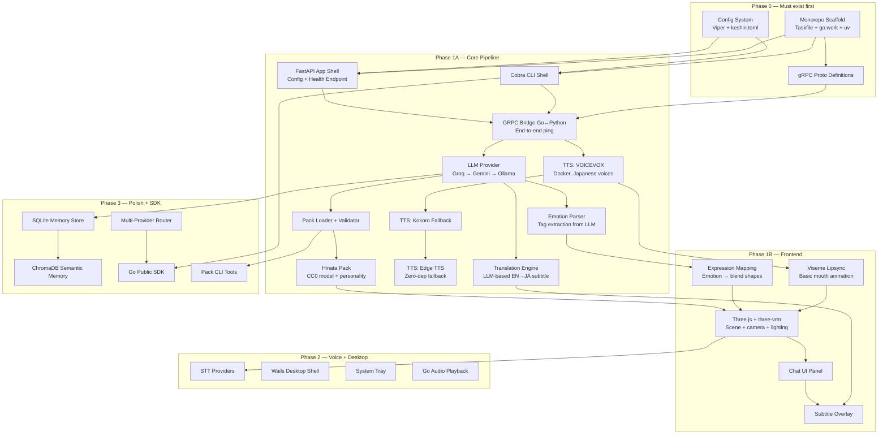

# Keshin Roadmap Execution Strategy & Improvements

> **Purpose:** Strategic analysis of the ROADMAP.md execution order, dependency mapping, risk mitigation, and concrete improvements before Phase 1 begins.

---

## Executive Summary

The ROADMAP.md is well-structured with clear phases and deliverables. However, there are several architectural, scope, and dependency issues that should be addressed before writing any code. This document provides:

1. A **dependency-critical path analysis** showing what must be built first
2. A **revised phase structure** with improvements
3. **10 concrete improvements** to the roadmap
4. A **detailed Phase 1 execution plan** with task-level granularity

---

## 1. Dependency Graph & Critical Path



### Critical Path Analysis

The **longest dependency chain** is:

```
Monorepo → Config → CLI → gRPC Bridge → LLM Provider → Emotion Parser → Expression Mapping → Three.js
                                        → Translation → Subtitle Overlay → Integration
                                        → TTS VoiceVox → Lipsync → Three.js
```

**Key insight:** The gRPC bridge is the single most critical piece. Everything downstream depends on it. It should be working end-to-end with a trivial echo service by **Day 3-4**, not Week 2.

---

## 2. Improvements to the Roadmap

### Improvement 1: Start with HTTP, Add gRPC Later

**Problem:** gRPC adds proto compilation, versioning, and two-language code generation before any feature works. It's overhead at the start.

**Fix:** Phase 1 should use **FastAPI HTTP/JSON** (already the framework choice) for Go↔Python communication. The Go side uses a simple HTTP client. gRPC is added in Phase 3 as a performance optimization when the streaming pipeline needs it.

```
Phase 1:  Go → HTTP/JSON → FastAPI          (simple, debuggable, works)
Phase 3:  Go → gRPC → Python grpc_server     (performant, typed, streaming)
```

This means Phase 1 can demo within **2 weeks** instead of 4, because there's no proto toolchain to fight.

### Improvement 2: Make Edge TTS the Phase 1 Default, Not VOICEVOX

**Problem:** VOICEVOX requires Docker, ~2GB download, and network config. This is a heavy Day-1 dependency that blocks the "free-first" tenet.

**Fix:** Default TTS chain should be:

```
Phase 1:  Edge TTS (zero setup, pip install edge-tts) → demo in minutes
Phase 2:  Kokoro-FastAPI (self-hosted, Docker, good JP voices)
Phase 3:  VOICEVOX (Docker, best anime voices — optional install)
```

This doesn't remove VOICEVOX — it just means the first demo works without Docker. Users who want anime voices can add VOICEVOX later.

### Improvement 3: Split Phase 1 into Two Sub-Phases

**Problem:** Phase 1 is doing too much — monorepo setup, Go core, Python bridge, gRPC, LLM, TTS, translation, emotion, VRM rendering, chat UI, subtitles, lipsync, and a character pack, all in 4 weeks.

**Fix:** Split into:

- **Phase 1A (Weeks 1-2):** Text-only pipeline. Type English → LLM responds in Japanese → subtitle shows translation. No 3D, no voice. Proves the Go↔Python↔LLM pipeline works.
- **Phase 1B (Weeks 3-4):** Add VRM rendering, TTS audio, lipsync, expressions. This is where the visual magic appears.

The Phase 1A demo is: "Open browser, type English, get Japanese response with English subtitle." That's testable, demonstrable, and achievable in 2 weeks.

### Improvement 4: Start Testing from Day 1

**Problem:** Testing is mentioned in Phase 3 ("Week 11-12: unit tests for each provider"). That's 10 weeks of untested code.

**Fix:** Each provider (LLM, TTS, STT) should have a `Protocol` interface with a mock implementation from the start. The pipeline should be testable with mock providers. Add a test task to every phase.

### Improvement 5: Add Error Handling & Retry Architecture Early

**Problem:** The roadmap describes multi-provider failover but doesn't address retry logic, circuit breakers, or graceful degradation until Phase 3.

**Fix:** Build the provider router with retry/backoff from Phase 1A. The interface should be:

```go
type LLMProvider interface {
    Generate(ctx context.Context, req GenerateRequest) (GenerateResponse, error)
}
```

```python
class LLMProvider(Protocol):
    async def generate(self, prompt: str, history: list[Message]) -> LLMResponse: ...
```

The router handles failover, retry, and rate limits. This is part of the core, not a polish feature.

### Improvement 6: Configuration Merging Strategy

**Problem:** The roadmap has `keshin.toml` (global config) and `character.toml` (per-pack config), but doesn't specify how they merge, especially for nested structures like `[voice]`.

**Fix:** Define clear merge rules:

```
1. character.toml values OVERRIDE keshin.toml values
2. keshin.toml PROVIDES defaults for anything not specified in character.toml
3. CLI flags OVERRIDE both
4. Environment variables OVERRIDE CLI flags (12-factor app)
```

Priority: `env > CLI flags > character.toml > keshin.toml > hardcoded defaults`

This should be documented in a `CONFIG-MERGE.md` spec.

### Improvement 7: Pipeline Should Be Step-Based, Not Monolithic

**Problem:** The current pipeline description is monolithic — one big function call. This makes testing, debugging, and extending hard.

**Fix:** Implement the pipeline as discrete steps with a middleware pattern:

```python
Pipeline = [
    STTStep(),           # Optional: voice → text
    ContextStep(),       # Load personality + history
    LLMStep(),           # Generate response
    EmotionParseStep(),  # Extract emotion tags
    TranslationStep(),   # Generate subtitle
    TTSStep(),           # Generate audio
    VisemesStep(),       # Map visemes
]

# Each step implements:
class PipelineStep(Protocol):
    async def execute(self, ctx: PipelineContext) -> PipelineContext: ...
```

This allows easy testing (skip steps, mock steps, reorder steps) and future extension (add RAG step, add moderation step, etc.)

### Improvement 8: Streaming-First Architecture

**Problem:** The roadmap defines both a full-response and streaming mode, but the gRPC protos and architecture seem optimized for full-response first, with streaming bolted on later.

**Fix:** Design the **streaming pipeline as the primary path**. Full responses are just streaming with a single chunk. This avoids duplicate code paths and ensures streaming works from day one.

```protobuf
// Primary: streaming response
rpc ChatStream(ChatRequest) returns (stream ChatStreamChunk);

// Convenience: aggregates stream into single response
rpc Chat(ChatRequest) returns (ChatResponse);
```

The HTTP endpoint should use SSE (Server-Sent Events) for Phase 1, upgraded to WebSocket for Phase 2+.

### Improvement 9: Add Health Check & Observability from Phase 1

**Problem:** No mention of health checks, metrics, or logging until deep in the project.

**Fix:**
- Go: Structured logging with Zap from day 1 (already in tech stack)
- Python: Structured logging with `structlog`
- Both: `/health` endpoint that reports provider availability
- Both: Request tracing with correlation IDs across Go↔Python boundary

### Improvement 10: Reduce Wails Scope in Phase 2

**Problem:** Wails desktop shell with system tray, transparent window, always-on-top, click-through, and window position memory is a lot for 2 weeks. Wails cross-platform transparent windows are known-problematic (the risk register acknowledges this).

**Fix:**
- Phase 2: Web-only mode with basic Wails wrapper (just opens the web view, no transparency)
- Phase 2.5 or early Phase 3: System tray + transparent window as a stretch goal
- Always have `--mode web` as the fallback

The desktop pet experience is compelling but not worth blocking the voice input pipeline.

---

## 3. Revised Phase Structure

### Phase 0: Bootstrap (Days 1-3)

**Goal:** Monorepo scaffolded, both languages building, CI green.

| Task | Duration | Depends On |
|------|----------|------------|
| Monorepo structure (go.work, uv, Taskfile) | 2h | — |
| Go Cobra CLI with `keshin version` | 1h | Monorepo |
| Python FastAPI app with `/health` | 1h | Monorepo |
| `keshin.toml` config loading (Viper) | 2h | Go CLI |
| CI: lint + build both | 1h | Both apps |
| Docker Compose: VOICEVOX + Kokoro | 30m | — |

**Deliverable:** `keshin version` prints version, `task dev:ai` starts FastAPI, Docker Compose runs VOICEVOX.

### Phase 1A: Text Pipeline (Weeks 1-2)

**Goal:** Type English in browser → LLM responds in Japanese → English subtitle shown.

| Task | Duration | Depends On |
|------|----------|------------|
| Pack loader: parse `character.toml` | 3h | Config system |
| Pack loader: validate pack structure | 2h | Pack loader parse |
| LLM provider interface + Groq impl | 4h | Python app shell |
| LLM provider: Gemini fallback | 2h | LLM interface |
| LLM provider: Ollama local | 2h | LLM interface |
| LLM router: failover chain | 3h | All LLM providers |
| Emotion parser: extract `[emotion:...]` tags | 2h | LLM router |
| Translation engine: LLM-based EN→JA subtitle | 2h | LLM router |
| Pipeline orchestrator (step-based) | 4h | LLM, emotion, translation |
| Pack: `_example` template + hinata | 2h | Pack loader |
| Go HTTP client to Python FastAPI | 3h | Go CLI, Python pipeline |
| Frontend: React + Vite + Tailwind setup | 2h | — |
| Frontend: Chat UI panel | 3h | React setup |
| Frontend: Subtitle overlay component | 2h | Chat UI |
| Frontend: Status bar (connection, provider) | 1h | Chat UI |
| Integration: Go → Python → LLM → Frontend | 4h | All above |
| SSE streaming endpoint | 3h | Integration |

**Deliverable:**
```bash
keshin run --character hinata --mode web --port 8080
# → Browser opens
# → Type "Hello" → Hinata responds in Japanese
# → English subtitle appears below
# → Emotion detected and displayed as text badge
```

### Phase 1B: Visual + Voice Pipeline (Weeks 3-4)

**Goal:** 3D character with expressions, lip-sync, and audio output.

| Task | Duration | Depends On |
|------|----------|------------|
| Three.js + three-vrm scene setup | 4h | Frontend from 1A |
| VRM model loading + idle animation | 3h | Three.js setup |
| Expression mapping (emotion → blend shapes) | 3h | Emotion parser, VRM |
| TTS: Edge TTS provider (zero-dep) | 2h | Python app |
| TTS: Kokoro provider | 3h | Docker Compose |
| TTS: VOICEVOX provider | 3h | Docker Compose |
| TTS router: failover chain | 2h | TTS providers |
| Viseme mapping + lipsync | 4h | TTS routers |
| Audio streaming: Python → Go → Frontend | 4h | Go HTTP client |
| Character viewer component | 3h | VRM, expressions |
| Integration: audio + visual pipeline | 6h | All above |
| Hinata pack: personality tuning | 2h | Integration |

**Deliverable:**
```bash
keshin run --character hinata --mode web --port 8080
# → 3D Hinata appears in browser
# → Type "Hello" → she responds in Japanese
# → Mouth animates with speech
# → Expression changes based on emotion
# → English subtitle below character
# → Audio plays through browser
```

### Phase 2: Voice Input + Desktop Shell (Weeks 5-8)

**Goal:** Push-to-talk voice input, Wails desktop mode, system tray.

| Week | Focus | Key Deliverable |
|------|-------|----------------|
| 5 | STT: faster-whisper + Groq Whisper | Voice input works |
| 6 | Push-to-talk UI + audio pipeline streaming | Real-time voice interaction |
| 7 | Wails desktop shell + basic window | Desktop mode works |
| 8 | System tray + transparent window + packaging | Desktop pet mode |

### Phase 3: Polish, Memory, SDK (Weeks 9-12)

**Goal:** Conversation memory, provider failover, Go SDK, pack tooling, tests.

| Week | Focus | Key Deliverable |
|------|-------|----------------|
| 9 | SQLite memory + summarization | Conversations persist |
| 10 | Multi-provider router + settings UI | Failover works smoothly |
| 11 | Go SDK (`pkg/keshin`) + gRPC upgrade | SDK ready for developers |
| 12 | Pack CLI tools + docs + integration tests | Developer onboarding ready |

### Phase 4: Live2D + Plugins + Deployment (Weeks 13-16)

Unchanged from original roadmap — too far out to detail now.

### Phase 5: Community + Ecosystem (Weeks 17-24)

Unchanged from original roadmap — too far out to detail now.

---

## 4. Risk Assessment Additions

Beyond the existing risk register, I'd flag:

| # | New Risk | Likelihood | Impact | Mitigation |
|---|---------|-----------|--------|------------|
| 11 | **three-vrm version compatibility** | High | Medium | Pin three-vrm version, test with specific VRM files, have fallback 2D renderer |
| 12 | **Viseme timing accuracy** | Medium | High | VOICEVOX provides phoneme timing; use it directly. Fall back to estimated timing for Edge TTS |
| 13 | **Browser audio autoplay restrictions** | High | High | Require user interaction first (click to start). Use AudioContext after gesture |
| 14 | **Cross-platform audio differences** | Medium | Medium | Phase 1: use Web Audio API (browser). Phase 2: portaudio for desktop |
| 15 | **Python dependency conflicts** | Medium | Medium | Use uv with pinned versions. Docker for deployment isolation |

---

## 5. What Can Be Parallelized

These work streams can run **simultaneously** by different developers (or in parallel sprints):

```mermaid
gantt
    title Phase 1 Parallel Work Streams
    dateFormat X
    axisFormat %s
    
    section Go Core
    Monorepo + CLI                     :g1, 0, 1
    Config system (Viper)               :g2, 1, 2
    HTTP client to Python               :g3, 3, 4
    SSE streaming client                :g4, 6, 7

    section Python AI
    FastAPI shell + /health             :p1, 0, 1
    LLM providers (Groq, Gemini, Ollama):p2, 1, 4
    Emotion parser                      :p3, 2, 3
    Translation engine                  :p4, 2, 3
    Pipeline orchestrator               :p5, 4, 5
    TTS providers (Edge, Kokoro, VOICEVOX):p6, 5, 8

    section Frontend
    React + Vite + Tailwind setup       :f1, 2, 3
    Chat UI panel                       :f2, 3, 5
    Three.js + VRM scene                :f3, 5, 7
    Expression + lipsync                :f4, 7, 9
    Subtitle overlay                    :f5, 3, 5

    section Packs
    Pack loader + validator             :c1, 1, 3
    _example template + hinata          :c2, 3, 4
    Hinata personality tuning           :c3, 8, 9
```



**Parallelization rules:**
- Go Core and Python AI can be developed in parallel after the monorepo scaffold
- Frontend can start once the HTTP endpoint contract is defined (doesn't need working backend)
- Packs can be designed before the pipeline works
- Integration happens when all streams converge

---

## 6. Recommended API Contract (Go ↔ Python)

Before splitting work, define the HTTP contract. This is the single most important document for parallel development.

### Phase 1A: Text-Only Endpoints

```
POST /api/chat
  Body: { character_id: string, message: string, session_id?: string }
  Response: { japanese_text: string, english_subtitle: string, emotion: string }

GET /api/chat/stream
  SSE: { type: "text"|"emotion"|"subtitle", content: string }

GET /api/characters
  Response: { characters: [{ id: string, name: string, description: string }] }

GET /health
  Response: { status: "ok", providers: { llm: string, tts: string } }
```

### Phase 1B: Add Audio Endpoints

```
POST /api/tts
  Body: { text: string, character_id: string, provider?: string }
  Response: { audio_url: string, visemes: [...] }

GET /api/tts/stream
  SSE: { type: "audio"|"viseme", data: bytes|object }
```

### Phase 2+: Upgrade to gRPC

Once the HTTP endpoints are proven, mirror them as gRPC services for streaming performance.

---

## 7. Technical Decisions to Make Before Phase 1

| Decision | Options | Recommendation | Rationale |
|----------|---------|---------------|-----------|
| Go↔Python transport | HTTP/JSON vs gRPC | **HTTP/JSON first, gRPC in Phase 3** | Faster to build, easier to debug, no proto toolchain overhead |
| Default TTS | Edge TTS vs VOICEVOX vs Kokoro | **Edge TTS for Phase 1, VOICEVOX optional** | Zero setup, pip install only |
| Frontend transport | REST + SSE vs WebSocket vs gRPC-Web | **REST + SSE for Phase 1** | Simple, works everywhere, sufficient for streaming |
| State management | Zustand vs Redux vs Jotai | **Zustand** | Already in roadmap, lightweight, good for Wails |
| Python package manager | pip vs poetry vs uv | **uv** | Already in roadmap, fastest |
| Monorepo task runner | Make vs Taskfile vs Nx | **Taskfile** | Already in roadmap, polyglot-friendly |
| Frontend framework | React vs Svelte vs Vue | **React** | Already in roadmap, Wails templates available |
| VRM rendering | three-vrm vs custom | **three-vrm** | Already in roadmap, mature library |

---

## 8. Immediate Next Steps (Ordered)

These are the **exact steps** to take, in order, to start building Phase 1A:

1. **Initialize monorepo** — go.mod, go.work, pyproject.toml, Taskfile.yml, .gitignore
2. **Create config system** — `keshin.toml` parsing with Viper, with defaults from roadmap Section 8
3. **Build Go CLI** — Cobra with `keshin version`, `keshin run`, `keshin config`
4. **Build Python FastAPI shell** — `/health`, `/api/chat` stub, `/api/characters` stub
5. **Define HTTP contract** — Write `docs/API.md` with endpoints above
6. **Implement LLM provider** — Groq first, with router interface for fallback
7. **Implement emotion parser** — Extract `[emotion:...]` tags from LLM output
8. **Implement translation** — LLM-based EN→JA within the same chat prompt
9. **Implement pipeline orchestrator** — Step-based pipeline in Python
10. **Build pack loader + hinata pack** — Parse character.toml, validate, load personality
11. **Build frontend** — React + Vite + Tailwind, chat panel, subtitle overlay
12. **Connect Go → Python → Frontend** — End-to-end integration
13. **Add SSE streaming** — Streaming text response
14. **Test + demo** — Record a demo video

**Estimated time to Phase 1A deliverable: 2 weeks.**

---

## 9. Summary of Improvements

| # | Improvement | Impact | Phase Changed |
|---|------------|--------|---------------|
| 1 | HTTP-first, gRPC later | Faster Phase 1 by ~1 week | Phase 1, 3 |
| 2 | Edge TTS as default, not VOICEVOX | Zero-setup first run | Phase 1 |
| 3 | Split Phase 1 into 1A (text) + 1B (visual) | Parallel, achievable sprints | Phase 1 |
| 4 | Testing from Day 1 | Catch bugs before they compound | All phases |
| 5 | Provider router with retry from start | Robustness from the beginning | Phase 1A |
| 6 | Config merge priority rules | Clear, documented behavior | Phase 1A |
| 7 | Step-based pipeline architecture | Testable, extensible | Phase 1A |
| 8 | Streaming-first design | Clean architecture, no dual paths | Phase 1A |
| 9 | Health check + observability from Day 1 | Debugging made easier | Phase 1A |
| 10 | Reduce Wails scope in Phase 2 | Lower risk, faster delivery | Phase 2 |

---

*This strategy document is a living reference. Update as Phase 1 progresses and lessons are learned.*