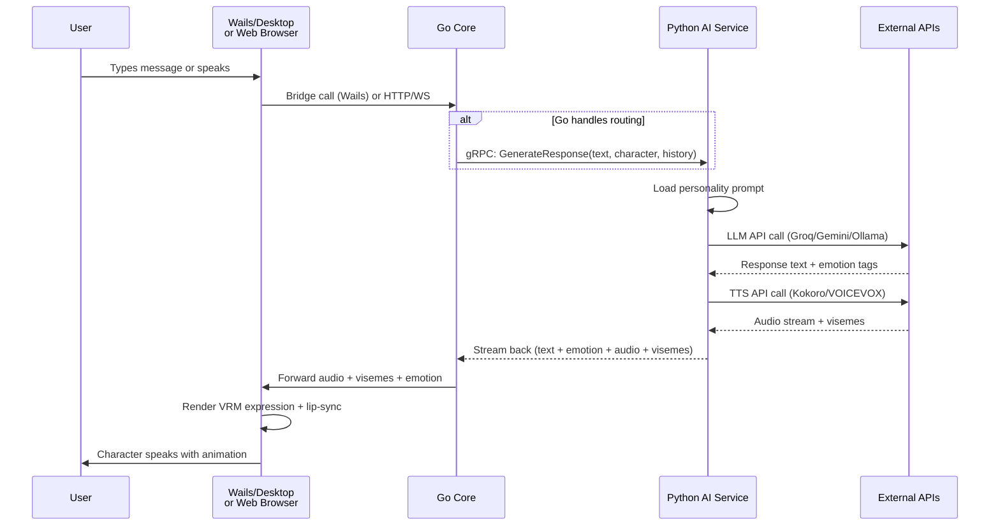

```mermaid
sequenceDiagram
    participant U as User
    participant W as Wails/Desktop<br/>or Web Browser
    participant G as Go Core
    participant P as Python AI Service
    participant Ext as External APIs

    U->>W: Types message or speaks
    W->>G: Bridge call (Wails) or HTTP/WS
    
    alt Go handles routing
        G->>P: gRPC: GenerateResponse(text, character, history)
    end
    
    P->>P: Load personality prompt
    P->>Ext: LLM API call (Groq/Gemini/Ollama)
    Ext-->>P: Response text + emotion tags
    P->>Ext: TTS API call (Kokoro/VOICEVOX)
    Ext-->>P: Audio stream + visemes
    P-->>G: Stream back (text + emotion + audio + visemes)
    
    G->>W: Forward audio + visemes + emotion
    W->>W: Render VRM expression + lip-sync
    W->>U: Character speaks with animation
```